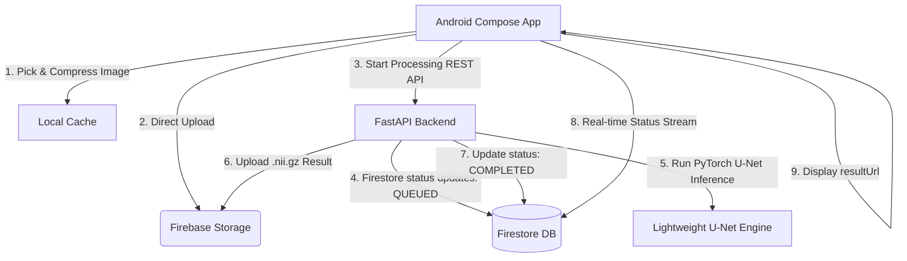

# PDD_APP: End-to-End Medical AI Platform

PDD_APP is a complete, production-ready full-stack medical image processing application. The system comprises a Kotlin Android application and a FastAPI backend service featuring a lightweight PyTorch U-Net neural network for medical image segmentation.

---

## 🏗️ System Architecture



---

## ⚡ Setup & Execution Guide

### 1. FastAPI Backend Setup (Local Machine)
Ensure Python 3.11 is installed on your Windows machine. Open PowerShell and run:

```powershell
# Navigate to the backend folder
cd C:\Users\prasa\Documents\PDD_APP\backend

# Install/Update dependencies in virtual environment
..\venv\Scripts\python -m pip install -r requirements.txt

# Start the FastAPI server with auto-reload enabled
..\venv\Scripts\python -m uvicorn app.main:app --host 0.0.0.0 --port 8000 --reload
```

---

### 2. Android App Studio Setup
1. **Open Project**: Import `C:\Users\prasa\Documents\PDD_APP` into Android Studio.
2. **Build Variant**: Select the `debug` build variant inside Android Studio (*Build -> Select Build Variant...*). 
   - Debug variant automatically injects `BuildConfig.BACKEND_ENV = "emulator"`, resolving the local endpoint to `http://10.0.2.2:8000`.
3. **Local LAN Testing**: If deploying to a physical device on the same local network, modify `LOCAL_DEVICE_API_BASE_URL` in `Constants.kt` with your computer's local IP address (e.g. `http://192.168.1.100:8000`).
4. **Compile and Run**: Run the application by pressing `Shift + F10`.

---

### 3. Docker Deployments (DevOps Mode)
If you prefer running the backend in Docker containers:

```bash
# Navigate to the backend folder
cd C:\Users\prasa\Documents\PDD_APP\backend

# Build and start services using Docker Compose
docker-compose up --build -d
```

---

## 🧪 Integration Testing Guide

We provide an automated integration validation script that performs an end-to-end simulation of the user lifecycle, file uploading, and processing workflow.

### Executing the Smoke Test:
Ensure your local FastAPI backend is active, and run the following in PowerShell:

```powershell
cd C:\Users\prasa\Documents\PDD_APP\backend
powershell -ExecutionPolicy Bypass -File .\smoke_test.ps1
```

### Endpoints Validated:
1. `GET /health` - Checks server health and Firebase configuration.
2. `POST /auth/register` - Simulates registering a new client account.
3. `POST /auth/login` - Validates credential checks and responses.
4. `POST /upload` - Multipart form parser uploading raw files.
5. `POST /process` - Creates a job record in Firestore and initiates the AI task.
6. `GET /process/status/{jobId}` - Real-time polling verification of job completion.
7. `GET /process/result/{jobId}` - Retreives final volume scores and download links.
